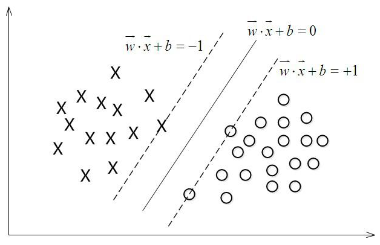

[TOC]

机器学习笔记

# SVM

支持向量机（Support Vector Machines，SVM）是一种二分类模型，基本模型是定义在特征向量的间隔最大化的线性分类器，学习的策略是间隔最大化，可以转化为求解凸二次划问题。支持向量机还包含核函数，实质是一种非线性分类器。SVM的三个层次，线性可分SVM，线性SVM，非线性SVM。

空间中有两类数据，x 是-1，o是1。学习一个超平面$w^Tx+b=0$把两类数据分开。

对于

